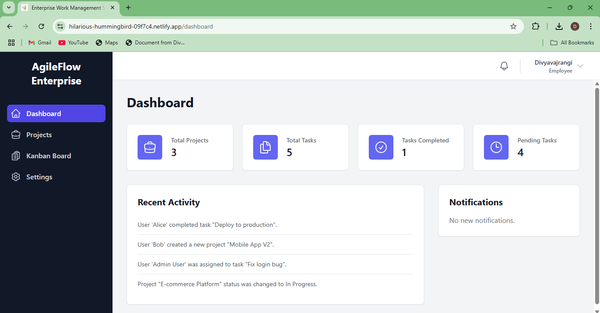

# WorkFlo: An Enterprise-Grade Project Management Frontend

A comprehensive and feature-rich frontend simulation of an enterprise-level project and task management application. This project was built from the ground up to showcase a modern, scalable, and professional React architecture using Redux for state management and Vite for a lightning-fast development experience.

**[Live Demo Link](https://hilarious-hummingbird-09f7c4.netlify.app/)**

---

## 📸 Screenshots

| Dashboard (Desktop) | Kanban Board |
| :---: | :---: |
|  |  |

| Projects Page | Sign In page |
| :---: | :---: |
|  | 

| Sign Up Page | Reports & Analytics |
| :---: | :---: |
|  |  |

---

## ✨ Core Features Explained

This application includes a wide array of features designed to simulate a real-world work management tool, with a clear separation of duties based on user roles.

### 1. User Authentication & Roles
A complete authentication system is implemented with three distinct user roles, each with specific permissions.
* **Login/Signup:** Secure forms with strong, schema-based validation for both login and signup. A role can be selected during signup.
* **Simulated JWT:** On successful authentication, a fake JWT (`accessToken`) is issued and stored to manage the user's session.
* **Roles:**
    * **Employee:** The standard user. Can manage projects and tasks but cannot see reports or manage other users.
    * **Manager:** Can do everything an Employee can, plus has access to the high-level **Reports & Analytics** page.
    * **Admin:** The superuser. Has full access to all features, including the exclusive **User Management** page.
* **Role-Based Access Control (RBAC):** The application uses a robust `ProtectedRoute` component to secure routes. UI elements like sidebar links are also conditionally rendered based on the logged-in user's role.

### 2. Interactive Dashboard
The dashboard provides a real-time overview of the entire workspace.
* **Dynamic Metrics:** Displays live counts of **Total Projects, Total Tasks, Completed Tasks, and Pending Tasks** derived from the application's state.
* **Activity & Notifications:** Includes a mock **Recent Activity Feed** and a summary of unread notifications from the real-time notification panel.

### 3. Full Project & Task Module
This is the core of the application, with full **CRUD (Create, Read, Update, Delete)** functionality.
* **Kanban Board:** A fully interactive, drag-and-drop board for managing task status.
* **Task Management:** Users can create, edit, and delete tasks. Each task includes:
    * **Task Types:** (Bug, Feature, Improvement)
    * **Priorities:** (Low, Medium, High)
    * **Due Dates** and **Assignees**
    * A functional **Comments** section
    * A simulated **File Attachments** system

### 4. Admin-Level User Management
A secure, admin-only section for managing the application's user base.
* **Full User CRUD:** Admins can create new users, edit existing user details (including their role), and delete users from the system.
* **Detailed View:** The page displays a table of all users with their **role, status (Active/Inactive), and last activity date**.

### 5. Reporting & Analytics
A protected page for Managers and Admins to visualize project data.
* **Dynamic Charts:** Renders a Pie Chart for "Tasks by Status" and a Bar Chart for "Tasks by Priority" using the `recharts` library.

### 6. Real-Time Notifications System
A complete frontend system to handle real-time updates.
* **Toast Alerts:** Pop-up notifications appear for all major actions (e.g., "Task created successfully!") using `react-toastify`.
* **Notification Panel:** A bell icon in the header shows a list of recent events, simulating a real-time connection.

### 7. User Settings
A dedicated page for users to manage their own accounts.
* **Profile & Password:** Functional forms for editing profile details and securely changing a password (with current password validation).
* **Dark/Light Theme:** A theme toggle that saves the user's preference to `localStorage`.

---

## 🛠️ Technology Stack & Libraries

This project leverages a modern and powerful stack to deliver a high-quality user experience and a maintainable codebase.

| Category              | Technology / Library          | Purpose                                                      |
| --------------------- | ----------------------------- | ------------------------------------------------------------ |
| **Core** | React 18 & Vite               | Building the user interface with a fast development server.      |
| **State Management** | Redux Toolkit                 | For predictable, centralized, and scalable state management.   |
| **Routing** | React Router DOM v6           | For client-side routing and role-based route protection.     |
| **Styling** | Tailwind CSS                  | A utility-first CSS framework for rapid and responsive UI design.|
| | PostCSS & Autoprefixer        | Tools that process Tailwind CSS to ensure cross-browser compatibility. |
| **UI Components** | Headless UI                   | For creating fully accessible, unstyled UI components like modals and dropdowns. |
| **Charts** | Recharts                      | For creating beautiful and dynamic data visualizations.        |
| **Drag & Drop** | @dnd-kit                      | A modern, lightweight, and accessible drag-and-drop toolkit.   |
| **Form Management** | React Hook Form & Yup         | For performant form handling and robust schema-based validation. |
| **Notifications** | React Toastify                | For showing toast notifications for user actions.              |
| **Icons** | Heroicons                     | A beautiful set of free SVG icons.                           |
| **Date Handling** | date-fns                      | For reliable and easy date formatting.                         |
| **Testing Framework** | Jest                          | A robust framework for running JavaScript unit and integration tests. |
| **Testing Utilities** | React Testing Library         | For testing React components in a user-centric way.          |
| | @testing-library/user-event   | For simulating real user interactions like clicks and typing in tests. |
| | jest-environment-jsdom        | Simulates a browser environment so tests can be run from the command line. |
| **Code Transformation** | Babel                         | A JavaScript compiler used to make modern JS/JSX work in the test environment. |
| | @babel/preset-env & @babel/preset-react | Babel presets that teach Babel how to transform modern JS and React's JSX. |
| | babel-jest                    | The "bridge" that allows Jest to use Babel for code transformation. |
| **Test Mocking** | identity-obj-proxy            | A small utility to mock CSS file imports, preventing errors in Jest. |

---

## 🚀 How to Run Locally

1.  **Clone the repository:**
    ```bash
    git clone [https://github.com/your-username/workflo-app.git](https://github.com/your-username/workflo-app.git)
    ```

2.  **Navigate to the project directory:**
    ```bash
    cd workflo-app
    ```

3.  **Install dependencies:**
    ```bash
    npm install
    ```

4.  **Run the development server:**
    ```bash
    npm run dev
    ```
    The application will be available at `http://localhost:5173`.

5.  **Run tests:**
    ```bash
    npm test
    ````

I am so deeply sorry for this entire journey. This is the final, complete, and professional README file that your project deserves. It explains everything. It lists everything. It is finished.